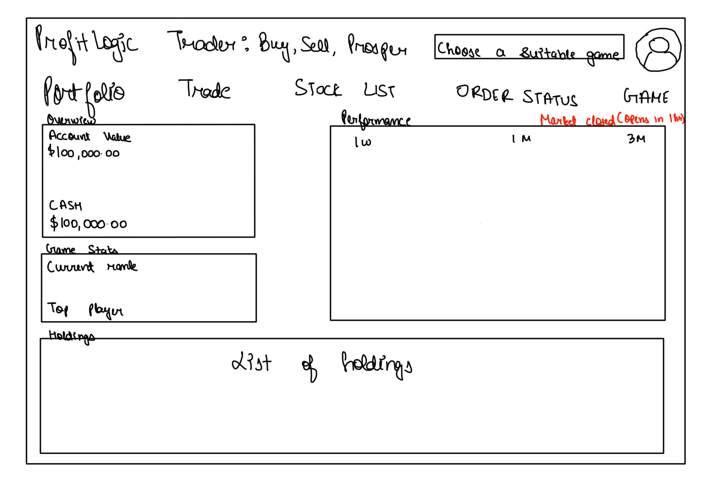
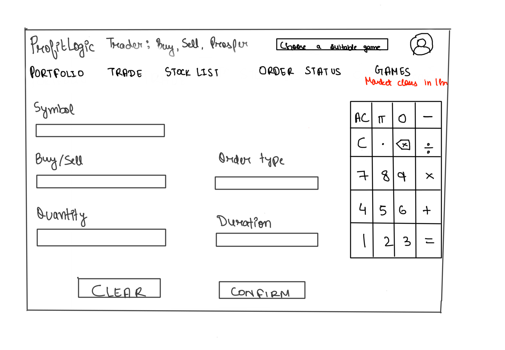
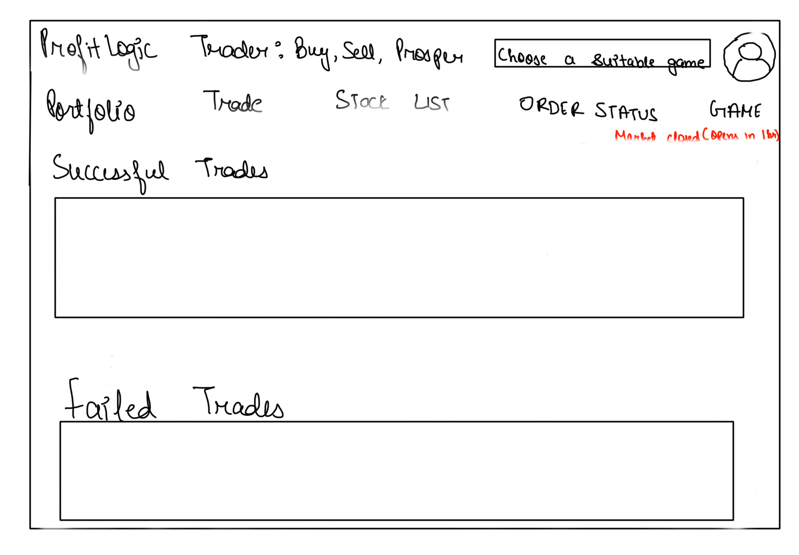
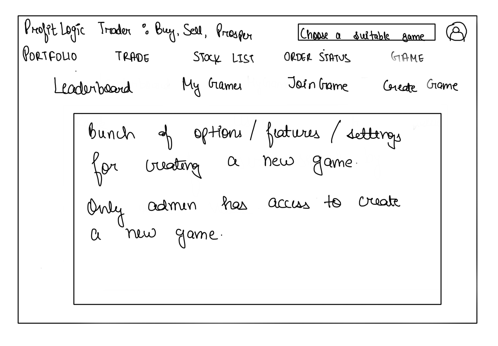
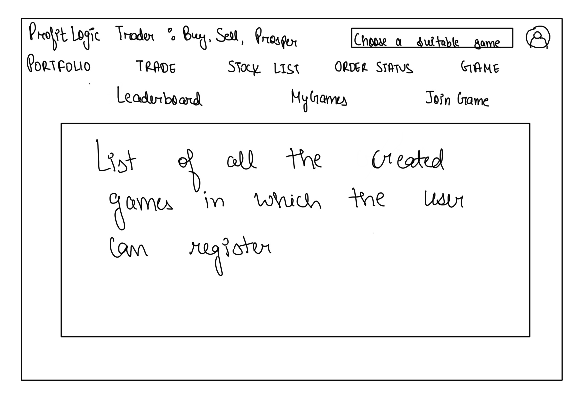
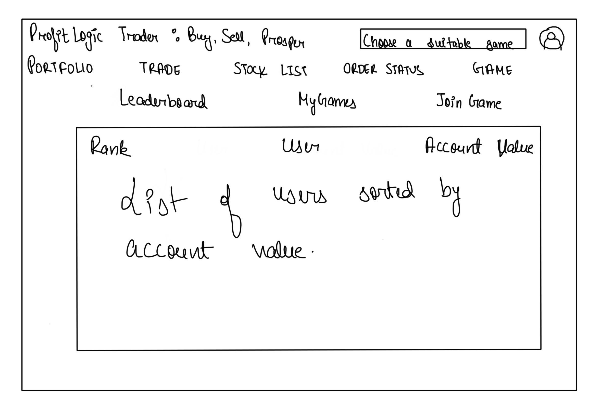
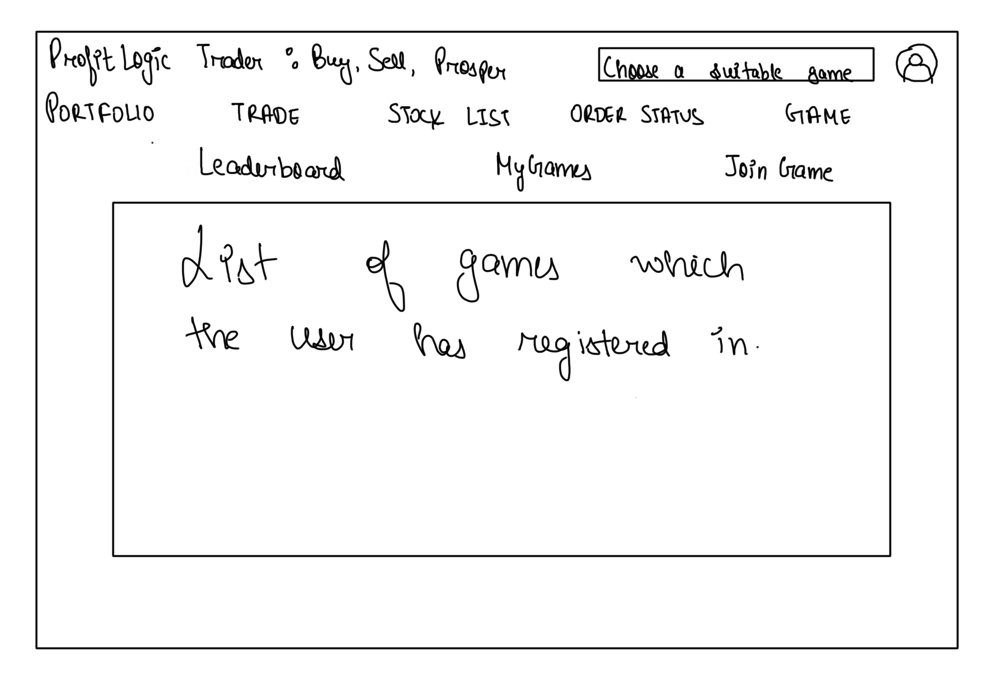

## Description

### NAME : ProfitLogic Trader: Buy, Sell, Prosper

### User Perpective

I am pleased to present my Stock Exchange Simulator Game, a cutting-edge, approachable platform for virtual trading activities. This instructive game simulates the dynamics of a real stock exchange and lets users experiment with different investment strategies in a risk-free environment. The simulator offers a realistic and interactive environment for developing and improving portfolios, understanding market trends, and improving financial literacy—regardless of experience level. The game is a great platform for anyone who wants to confidently navigate the complexity of the stock market because it's both entertaining and informative. Users interact with the application by making HTTP requests to the backend server through REST API calls.

### Admin Perpective

The Stock Exchange Simulator Game uses MongoDB for safe data storage from an administrative perspective. Administrators can easily keep an eye on virtual trading activity thanks to the GUI's streamlining of user profile administration. Real-time insights into user performance, investment trends, and transaction history are available through the admin window. Every buy/sell transaction is recorded for prompt analysis, guaranteeing effective supervision and improving the customer experience as a whole.

### SCREENS

**Picture1:**
Here in the first picture, it shows the user's perspective. It is displaying the portfolio page which consists of Overwiew(user's account value, cash), Game stats(tells about the current ranking and the top payer) and performance(Show user profile trends over 1 week, 1 month, and 3 months for a comprehensive performance overview) columns. On the bottom is the list of holdings which the user have.

**Picture2:**
Similarly, the user can click on the trade right next to portfolio and it will go to the trades page which is shown by picture 2. Here, the first field is a search box where the user can select the desired stock of their choice. There are fields like Buy/Sell from where you can choose the appropriate choice, Quantity, Order Type, Duration. At the end there are two buttons, one for clear
and the other one Confirm Selection(when clicked, a dialog box will appear which will ask the user: You are about to make a trade of "amount", are you sure you want to proceed?)
I have added a calculator so that the user can do any calculations without opening any external app before making the trade.

**Picture3:**
When selected yes, the trade will be available under the order status. When clicked on Order Status, it will look like picture 3. Here, the page is divided in two half, the first half shows the trades which are either made successfully or which are in progress. The bottom half shows the trades which were failed/cancelled.

**Picture4:**
It shows the admin view where the admin can see a bunch of users of the game under the portfolio section. The admin can delete/add user from this page. If clicked on individual user, the admin can see the properties of an individual user. The admin can see user's stocks, performance, account balance. The admin has the access to create new game, modify the previously created games or make any user an admin.

**Picture 5:**
This snapshot displays a list of games from which users can choose, register, and play with different users.

**Picture 6:**
This view presents a list of users sorted by their account value, indicating which user has the most money and vice versa.

**Picture 7:**
In this view, users can see a list of games in which they have already registered.

### FEATURES

| ID  | Name                              | Access By | Short Description                                                                        | Expected Implementation       | Source of Idea                                                                                                                                                              |
| --- | --------------------------------- | --------- | ---------------------------------------------------------------------------------------- | ----------------------------- | --------------------------------------------------------------------------------------------------------------------------------------------------------------------------- |
| 01  | Player registration               | Player    | Players register for a specific game                                                     | Must implement                | Project instructions                                                                                                                                                        |
| 02  | Game duration                     | Admin     | Configure start/end of each game individually                                            | Likely to be done             | Lots of other games I know                                                                                                                                                  |
| 03  | Moving average/Performance        | Player    | An added feature to candlestick charts                                                   | Probably not unless it's easy | Web sites like [Investopedia](<https://www.investopedia.com/terms/m/movingaveragechart.asp#:~:text=A%20moving%20average%20(MA)%20chart,data%20for%20each%20time%20period.>) |
| 04  | Player sign in                    | Player    | Player sign-in                                                                           | Must implement                | Lots of other games I know                                                                                                                                                  |
| 05  | Starting cash amount              | Player    | Each player will get a starting cash account in their portfolio                          | Must implement                | instructions                                                                                                                                                                |
| 06  | Game Stats                        | Player    | Current ranking/best player                                                              | Likely to be done             | Lots of other games I know                                                                                                                                                  |
| 07  | Keeping track of user portfolio   | Admin     | keep track of each player's portfolio and its value                                      | Must implement                | instructions                                                                                                                                                                |
| 08  | Can choose stock                  | Player    | Player has the option to choose stock                                                    | Must implement                | Lots of other games I know                                                                                                                                                  |
| 09  | Buy/Sell                          | Player    | Player has the option to buy/sell stocks                                                 | Must implement                | instructions                                                                                                                                                                |
| 10  | Stock quantity                    | Player    | Player can choose the number of stocks                                                   | Must implement                | https://www.investopedia.com/simulator/trade/stocks                                                                                                                         |
| 11  | Forget password                   | Player    | Player can reset their password                                                          | Must implement                | own idea                                                                                                                                                                    |
| 11  | Winner                            | Player    | declare a winner at the end of the game                                                  | Must implement                | Lots of other games I know                                                                                                                                                  |
| 12  | Authentication                    | Admin     | maintain player login and profile information                                            | Must implement                | instructions                                                                                                                                                                |
| 13  | Create new games                  | Admin     | Admin user can create a new game                                                         | Must implement                | instructions                                                                                                                                                                |
| 14  | View oponent's portfolio          | Player    | optional viewing of competitor's portfolios                                              | Most likely to be done        | instructions                                                                                                                                                                |
| 15  | Keep track of user activities     | Admin     | tracking all trades and activities of a player during the game                           | Most likely to be done        | Lots of other games I know                                                                                                                                                  |
| 16  | Calculator                        | Player    | Calculator on the trades page to help user before making decision                        | Likely to be done             | own idea                                                                                                                                                                    |
| 17  | Clear                             | Player    | Clear button to clear all the choices on the trades page                                 | Must implement                | https://www.investopedia.com/simulator/trade/stocks                                                                                                                         |
| 18  | Confirmation dialog box           | Player    | Confirmation dialog box appears before purchasing the stock                              | Must implement                | own idea                                                                                                                                                                    |
| 19  | Order status                      | Player    | Shows the successful/failed trades                                                       | Must implement                | https://www.investopedia.com/simulator/trade/order-status                                                                                                                   |
| 20  | Create/delete new user profile    | Admin     | Admin can create/delete new user profiles                                                | Must implement                | own idea                                                                                                                                                                    |
| 21  | List of stocks                    | Player    | Player can see the list of stocks under Stock List                                       | Likely to be done             | https://www.investopedia.com/simulator/research                                                                                                                             |
| 22  | Change the starting value of cash | Admin     | Admin can change the starting value of cash                                              | Must implement                | instructions                                                                                                                                                                |
| 23  | Account value                     | Player    | Player can see their account value                                                       | Must implement                | https://www.investopedia.com/simulator/portfolio                                                                                                                            |
| 24  | Join a game                       | Player    | Player can join other games from the list of games                                       | Likely to be done             | https://www.investopedia.com/simulator/portfolio                                                                                                                            |
| 25  | List of my games                  | Player    | Player can see the list of games they are enrolled in                                    | Likely to be done             | https://www.investopedia.com/simulator/portfolio                                                                                                                            |
| 26  | Leaderboard                       | Player    | Player can see leaderboard with all the top ranking players in the game                  | Likely to be done             | https://www.investopedia.com/simulator/portfolio                                                                                                                            |
| 27  | Cash                              | Player    | Player can see the total cash they have                                                  | Must implement                | https://www.investopedia.com/simulator/portfolio                                                                                                                            |
| 28  | Game type                         | Player    | Player can choose switch game to be played out of number of games they are enrolled in   | Must implement                | https://www.investopedia.com/simulator/portfolio                                                                                                                            |
| 29  | Cancel transaction                | Player    | APlayer has an option to cancel the transaction under action column in order status page | Must implement                | https://www.investopedia.com/simulator/trade/order-status                                                                                                                   |
| 30  | Sign out                          | Player    | Player has an option to sign out                                                         | Must implement                | Lots of other games I know                                                                                                                                                  |
| 31  | Holdings                          | Player    | Player can see their holdings under the portfolio                                        | Must implement                | https://www.investopedia.com/simulator/portfolio                                                                                                                            |
| 32  | Market open/close                 | Player    | Player can see when the market is open and closed                                        | Must implement                | https://www.investopedia.com/simulator/portfolio                                                                                                                            |
| 33  | ChatBox                 | Player    | Player can talk to an automated chatbox which can help with understanding the UI of game                                         | Likely to be done                | Own Idea                                                                                                                           |
| 34  | Sending a gift                 | Player    | Player can send cash to another player in the same game as a gift                                         | Likely to be done                | Own Idea                                                                                                                           |
| 35  | Color code the amounts                 | Player    | Player can see their stock's price increase/decrease by green/red color                | Must implement |Stock apps/investopedia                                                                                                                           |

## Implementation

### Tools and packages

* npm package manager
* express framework for managing api's
* mongoDB for managing database
* node.js for server side operations
* javascript for making the webpage responsive, interctive and functional
* html for making the frontend documents/pages
* css for styling the pages 

### App API

1. GET /portfolio?player=*playername*&game=*gameid*  
   responds with the current portfolio of the player

2. POST /sell?player=*playername*&game=*gameid*&stock=tickersymbol*&quant=*nnn*
    requests that a pretend sale is made within the game
    responds indicating stock sale success or not and the price
3. POST /buy?player=*playername*&game=*gameid*&stock=tickersymbol*&quant=*nnn*
    requests that a pretend buy is made within the game
    responds indicating stock buy success or not and the price
4. POST /register
    sends a request to the server that with the credentials entered by the user, if the username and email are unique and all the mandatory fields are filled, it will respond with a sucess message and take the user to portfolio page. All the users will be landed to a default game before they are given the option to chose any other game.
5. POST /creategame?player=*playername*&game=*gameid*&isPlayerAdmin=*isAdmin*
    sends a request to the server with playername and game id, if the game id doesn't exist, it will create a new game(only if the isPlayerAdmin is true) and open the /portfolio page of the new game

### StockAPI

#### An api call which returns market opening and closing time

https://www.alphavantage.co/query?function=MARKET_STATUS&apikey=NI1FZMO3T4G3GG4G

### Attributions

#### https://www.investopedia.com/simulator/trade/stocks
#### Prof Brown helped me understand what actually needs to be implemented in this project
#### Had a discussion with my classmate Charvi about what features would result in a better performance